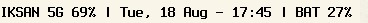

# sipbar

My personal status bar for [`mojito`](https://sr.ht/~dlm/mojito/)





## Build

```sh
make
```

## Install

```sh
doas make install
```
## Uninstall

```sh
doas make uninstall
```

## Use

```sh
sipbar | mojito
```

## Option

example:

```sh
sipbar -f "%H:%M:%S" | mojito       # hours:minustes:sec
sipbar -i 2 | mojito                 # redraw every 2 second
sipbar -w 10 | mojito                # poll WIFI every 10 tick
```
